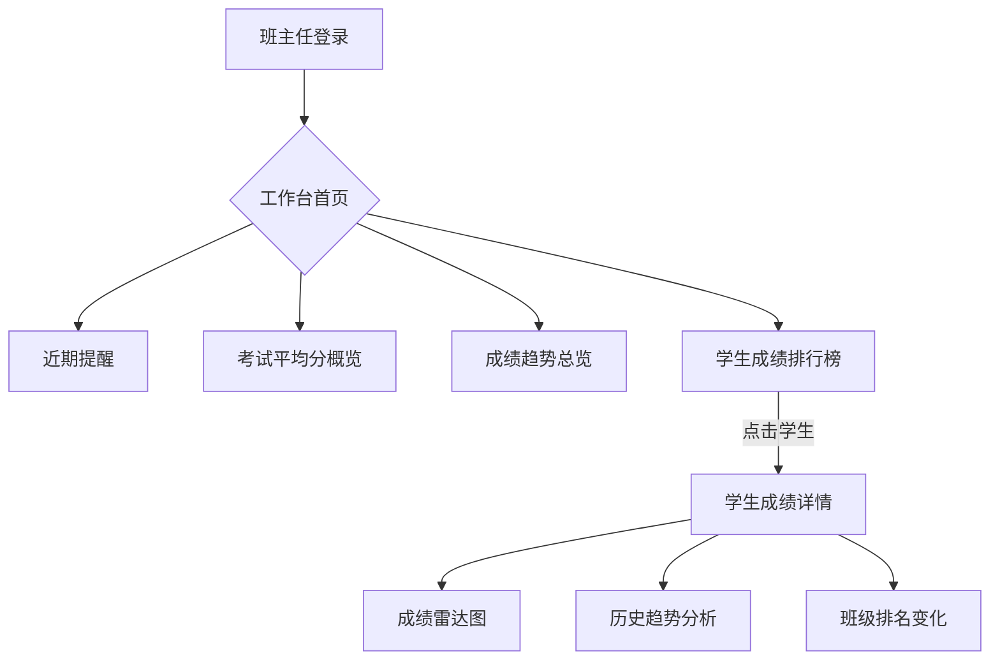

# 班主任工作台 - 产品需求文档 (PRD)

## 1. 产品概述

班主任工作台是一款面向中小学班主任教师的日常管理工具，旨在帮助班主任高效管理班级事务、追踪学生学业表现、及时发现和关注学生成长趋势。核心目标是将分散的班级管理工作整合到一个直观、易用的界面中，让班主任能够一目了然地掌握班级动态。

- **目标用户**：中小学班主任、年级主任
- **核心价值**：提升班主任日常管理效率，通过数据化手段辅助学业跟踪与决策

## 2. 核心功能

### 2.1 功能模块

1. **工作台首页（Dashboard）**
   - 近期提醒卡片
   - 考试班级平均分概览
   - 学生成绩及变化趋势总览

2. **学生成绩详情**
   - 学生成绩列表
   - 单科成绩趋势图表
   - 班级排名变化

### 2.2 页面详情

| 页面名称 | 模块名称 | 功能描述 |
|----------|----------|----------|
| 工作台首页 | 近期提醒 | 展示待办事项、考试倒计时、活动安排等，支持标记已完成 |
| 工作台首页 | 考试平均分 | 展示最近几次考试的班级各科平均分，与年级平均分会对比 |
| 工作台首页 | 成绩趋势 | 班级整体成绩趋势折线图，支持按科目筛选 |
| 工作台首页 | 学生成绩排行 | 展示学生成绩排名，支持快速查看变化趋势 |
| 学生详情 | 成绩雷达图 | 展示学生各科成绩分布 |
| 学生详情 | 历史趋势 | 学生个人成绩历史趋势折线图 |

## 3. 核心流程

班主任打开工作台后，首先看到首页 Dashboard，顶部展示近期待办提醒和考试倒计时。中部展示班级平均分概览和成绩趋势图表。底部是学生成绩排行榜，点击学生可进入详情页查看详细成绩分析。

## 4. 用户界面设计

### 4.1 设计风格

- **主色调**：深蓝色 (#1e3a5f) 作为主色，传达专业与可信赖的感觉
- **辅助色**：青绿色 (#2dd4bf) 作为强调色，用于数据高亮和积极指标
- **中性色**：浅灰 (#f8fafc) 背景，深灰 (#475569) 文字
- **警示色**：琥珀色 (#f59e0b) 用于提醒，红色 (#ef4444) 用于下降趋势
- **按钮风格**：圆角卡片式设计，微妙的阴影和悬停效果
- **字体**：使用现代中文无衬线字体（如系统默认 + PingFang SC / Microsoft YaHei）
- **布局风格**：卡片网格布局，左侧导航 + 主内容区
- **图标风格**：Lucide 线性图标，简洁现代

### 4.2 页面设计概览

| 页面名称 | 模块名称 | UI元素 |
|----------|----------|--------|
| 工作台首页 | 顶部导航栏 | 班主任头像、班级切换、通知铃铛 |
| 工作台首页 | 近期提醒 | 卡片列表，图标 + 标题 + 时间 + 状态标签 |
| 工作台首页 | 平均分概览 | 圆角卡片网格，每科一个卡片，显示分数 + 趋势箭头 |
| 工作台首页 | 成绩趋势 | 大面积折线图/面积图，支持科目筛选 Tab |
| 工作台首页 | 学生排行 | 表格列表，排名 + 姓名 + 总分 + 趋势火花线 |
| 学生详情 | 头部信息 | 学生头像、姓名、班级、联系方式 |
| 学生详情 | 雷达图 | 各科成绩雷达图 |
| 学生详情 | 趋势图 | 折线图展示历史考试成绩变化 |

### 4.3 响应式设计

- **桌面端优先**：主要针对 1366px 及以上屏幕优化
- **平板适配**：768px - 1024px 自适应布局
- **移动端**：单列堆叠布局，关键信息优先展示

## 5. 数据模型

### 5.1 核心实体

- **提醒事项(Reminder)**：id、标题、内容、类型（考试/活动/待办）、截止日期、完成状态
- **考试(Exam)**：id、名称、日期、科目、班级平均分、年级平均分
- **学生(Student)**：id、姓名、学号、班级、联系方式
- **成绩(Score)**：id、学生ID、考试ID、科目、分数、班级排名
