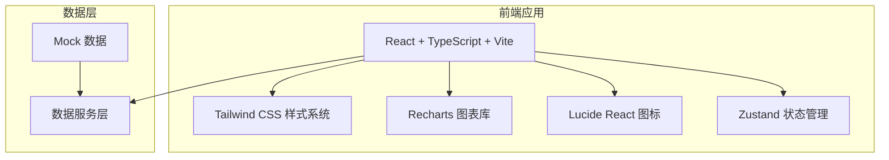

# 班主任工作台 - 技术架构文档

## 1. 架构设计



本项目为纯前端项目，使用 Mock 数据展示功能，不涉及真实后端服务。

## 2. 技术说明

- **前端框架**：React 18 + TypeScript
- **构建工具**：Vite
- **样式方案**：Tailwind CSS 3
- **图表库**：Recharts（用于成绩趋势图、雷达图）
- **图标库**：Lucide React
- **状态管理**：Zustand
- **路由**：React Router DOM
- **后端**：无（纯前端 Mock 数据）

## 3. 路由定义

| 路由 | 用途 |
|------|------|
| `/` | 工作台首页（Dashboard） |
| `/student/:id` | 学生成绩详情页 |

## 4. 数据模型

### 4.1 类型定义

```typescript
// 提醒事项
interface Reminder {
  id: string;
  title: string;
  content: string;
  type: 'exam' | 'activity' | 'todo';
  dueDate: string;
  completed: boolean;
}

// 考试记录
interface Exam {
  id: string;
  name: string;
  date: string;
  subject: string;
  classAverage: number;
  gradeAverage: number;
}

// 学生
interface Student {
  id: string;
  name: string;
  studentNo: string;
  className: string;
  avatar: string;
  totalScore: number;
  rank: number;
  trend: 'up' | 'down' | 'stable';
  trendValue: number;
}

// 成绩详情
interface Score {
  id: string;
  studentId: string;
  examId: string;
  subject: string;
  score: number;
  classRank: number;
  totalStudents: number;
}
```

### 4.2 Mock 数据结构

```typescript
const mockReminders: Reminder[] = [
  { id: '1', title: '期中考试', content: '下周一开始期中考试', type: 'exam', dueDate: '2026-08-05', completed: false },
  { id: '2', title: '家长会', content: '本周五下午召开家长会', type: 'activity', dueDate: '2026-08-02', completed: false },
  // ...
];

const mockExams: Exam[] = [
  { id: '1', name: '月考一', date: '2026-06-15', subject: '语文', classAverage: 82.5, gradeAverage: 80.2 },
  // ...
];

const mockStudents: Student[] = [
  { id: '1', name: '张三', studentNo: '2026001', className: '高一(3)班', totalScore: 685, rank: 1, trend: 'up', trendValue: 12 },
  // ...
];

const mockScores: Score[] = [
  { id: '1', studentId: '1', examId: '1', subject: '语文', score: 95, classRank: 2, totalStudents: 45 },
  // ...
];
```

## 5. 项目结构

```
src/
├── components/          # 可复用组件
│   ├── Sidebar.tsx      # 侧边导航栏
│   ├── ReminderCard.tsx # 提醒卡片
│   ├── ScoreChart.tsx   # 成绩趋势图表
│   ├── SubjectCard.tsx  # 学科平均分卡片
│   ├── StudentTable.tsx # 学生成绩表格
│   └── RadarChart.tsx   # 成绩雷达图
├── pages/
│   ├── Dashboard.tsx    # 工作台首页
│   └── StudentDetail.tsx # 学生详情页
├── data/
│   └── mockData.ts      # Mock 数据
├── store/
│   └── useStore.ts      # Zustand 状态管理
├── types/
│   └── index.ts         # TypeScript 类型定义
├── App.tsx
├── main.tsx
└── index.css
```

## 6. 设计规范

### 6.1 色彩系统

| Token | 色值 | 用途 |
|-------|------|------|
| primary | #1e3a5f | 主色调、导航栏、重要按钮 |
| primary-light | #2dd4bf | 强调色、数据高亮 |
| accent | #3b82f6 | 链接、次要按钮 |
| success | #10b981 | 上升趋势、积极指标 |
| warning | #f59e0b | 提醒、注意事项 |
| danger | #ef4444 | 下降趋势、警告 |
| bg-base | #f8fafc | 页面背景 |
| bg-card | #ffffff | 卡片背景 |
| text-primary | #1e293b | 主要文字 |
| text-secondary | #64748b | 次要文字 |
| text-muted | #94a3b8 | 辅助文字 |

### 6.2 间距系统

使用 4px 为基础单位：4、8、12、16、24、32、48

### 6.3 字体层级

- Display: 32px/400 (页面大标题)
- Heading: 20px/600 (卡片标题)
- Body: 14px/400 (正文)
- Caption: 12px/400 (注释、标签)
